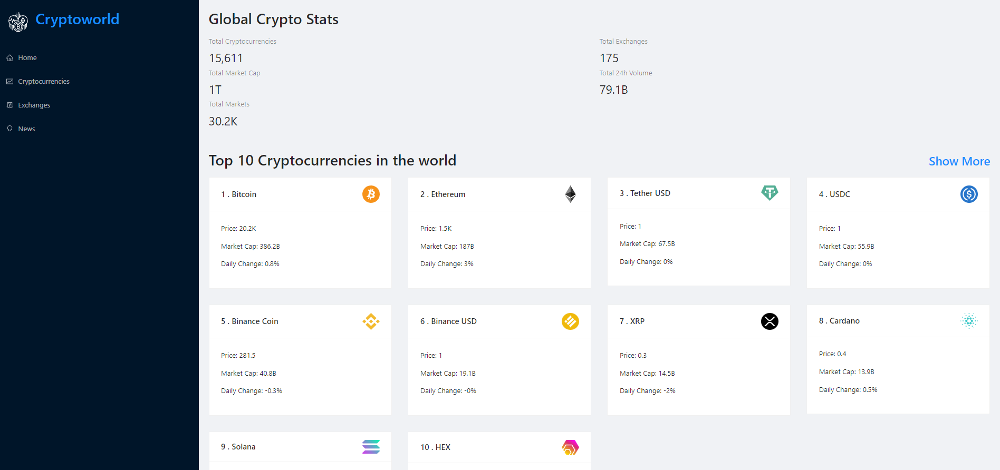
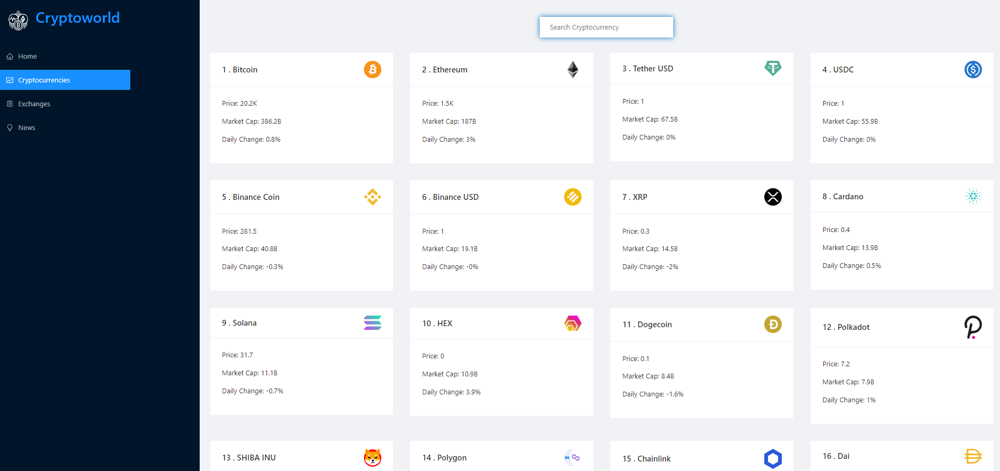
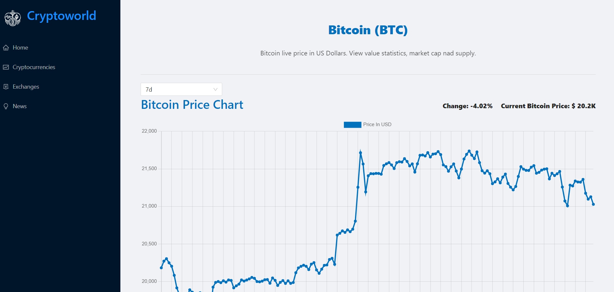
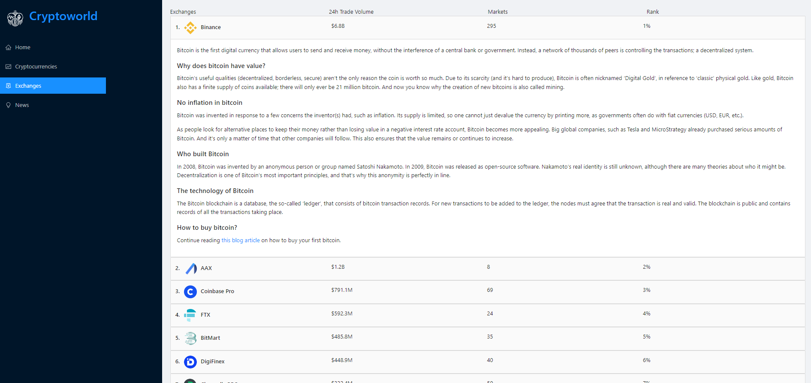
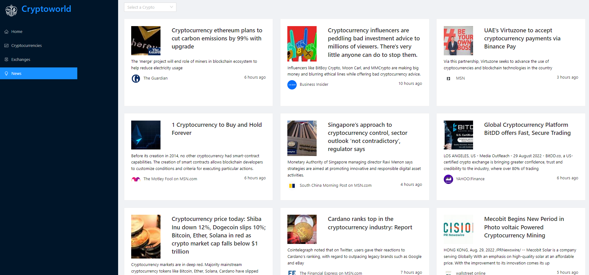

Responsive ReactJS Crypto discovery application that consumes Microsoft new bing search and CoinRanking API
=======
Introduction:
------
App Inforamtion:
------
`App Name:` CryptoWorld. 
`Created By:` Ahmed Al-Doori. 
`Front-End Techs:` HTML5, CSS3, JavaScript, ReactJS, Ant Design library, Chart.JS  
--------
The app will allow you to do the following:
 - Searching for Cryptocurrencies 
 - Global states around the world of cryptocurrencies
 - Marketcap,total exchanges ....etc
 - Latest news about cryptocurrencies
 - Full information and details about specfic cryptocurrency
 
 Software || Hardware Requirements:
 -----------
 - Internet Connection is Required
 - IDE that is able to react projects
 - Your own API Key from RapidAPI website (search for it) and register.
 - NodeJS run time 
 Setup Instructions:
 ------------
 <strong>1-</strong> Download the GitRepo as Zip or Pull it to your local repo 
 <strong>2-</strong> Open the project in your IDE 
 <strong>3-</strong> in folder services for both APIs put your own API Key 
 <strong>4-</strong> Finally Run (npm start) command in the root of the project  

Internal App ScreenShots:
-----------
 **- Home Page:**
</img>
 **- Cryptocurrencies Page:**
</img>
 **- Details Page:**
</img>
 **- Exchanges Page:**
</img>
 **- News Page:**
</img>

